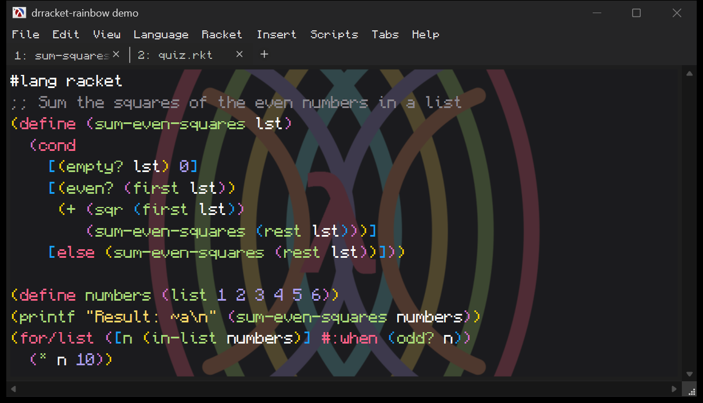

# DrRacket Dark Mods

Rainbow brackets, VS Code-style syntax colors, and a dark window frame for DrRacket.


This repo holds three independent packages. Install any combination.

| Package | What it does | Platforms |
|---|---|---|
| [`drracket-rainbow`](drracket-rainbow) | Rainbow brackets, more syntax roles, "Monokai Rainbow" color scheme | Windows, macOS, Linux |
| [`drracket-background`](drracket-background) | A faded background image behind the editor | Windows, macOS, Linux |
| [`drracket-dark-windows`](drracket-dark-windows) | Dark title bar, menu bar, toolbar, tabs and scrollbars | Windows only |

Tested with Racket 9.3 on Windows 11.

## drracket-rainbow

Stock DrRacket gives every identifier the same color. This plugin adds the roles VS Code shows:

| Role | Example | Color |
|---|---|---|
| Special forms | `define`, `lambda`, `cond`, `else`, `check-expect` | pink |
| Function being called | `sq` in `(sq x)` | green |
| Name being defined | `sq` in `(define (sq x) ...)` | green |
| Brackets, by nesting depth | `( [ (` | gold, purple, blue (repeats) |

It also adds a **Monokai Rainbow** color scheme for strings, numbers, comments and the REPL.

### Install

```bash
raco pkg install "https://github.com/AvocadoGG1/drracket-dark-mods.git?path=drracket-rainbow"
```

Restart DrRacket.
Then pick **Edit > Preferences > Colors > Color Schemes > Monokai Rainbow**.
That setting appears when DrRacket is in dark mode (**Background > White on Black**).

### Notes

- Only the token *color* changes, so indentation and paren matching behave exactly as before.
- **Check Syntax** paints its own identifier colors on top: imported names turn cyan and local names white.
  Editing the file brings the rainbow colors back.

## drracket-background

Put a picture behind your code, like VS Code's background-image extensions.
The picture is faded into the color scheme's background and stays fixed while the text scrolls over it.



### Install

```bash
raco pkg install "https://github.com/AvocadoGG1/drracket-dark-mods.git?path=drracket-background"
```

Restart DrRacket, then open **Edit > Preferences > Background Image**.

| Setting | Options |
|---|---|
| Image | Any PNG, JPEG, GIF or BMP file |
| Opacity | 0 to 100%; 15 to 30% keeps code readable |
| Placement | Fill (crop to cover), Fit, Bottom right, Center |
| REPL | Also show the picture behind the interactions window (off by default) |

Changes apply immediately, with no restart needed.

## drracket-dark-windows

On Windows, DrRacket's window frame ignores dark mode.
This package darkens it in two parts.

1. **The plugin** (no admin needed) handles the title bar, the menu bar, the dropdown menus and the editor scrollbars.
2. **An optional patch** to racket/gui handles the toolbar, tabs and status bar.
   It needs Administrator rights, because Racket is installed under Program Files.

With Monocraft set as the menu and toolbar font:


### Install

```bash
raco pkg install "https://github.com/AvocadoGG1/drracket-dark-mods.git?path=drracket-dark-windows"
```

Then, optionally, apply the patch from an **Administrator** terminal:

```bash
racket -l- drracket-dark-windows/patch apply
```

Restart DrRacket.
See [drracket-dark-windows/README.md](drracket-dark-windows/README.md) for settings, custom fonts and how to undo.

## License

[MIT](LICENSE)
